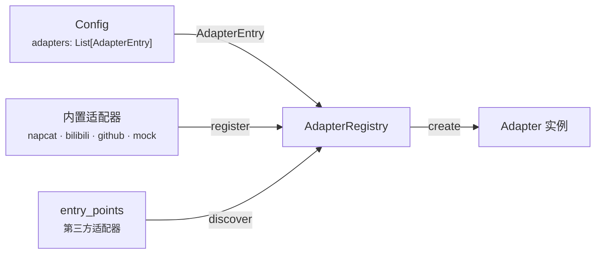
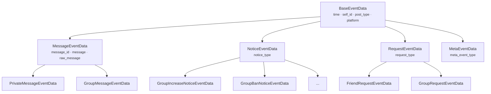
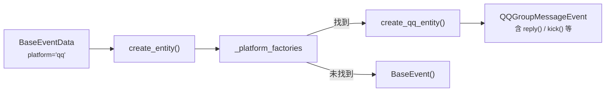
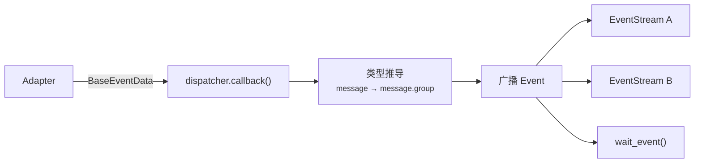
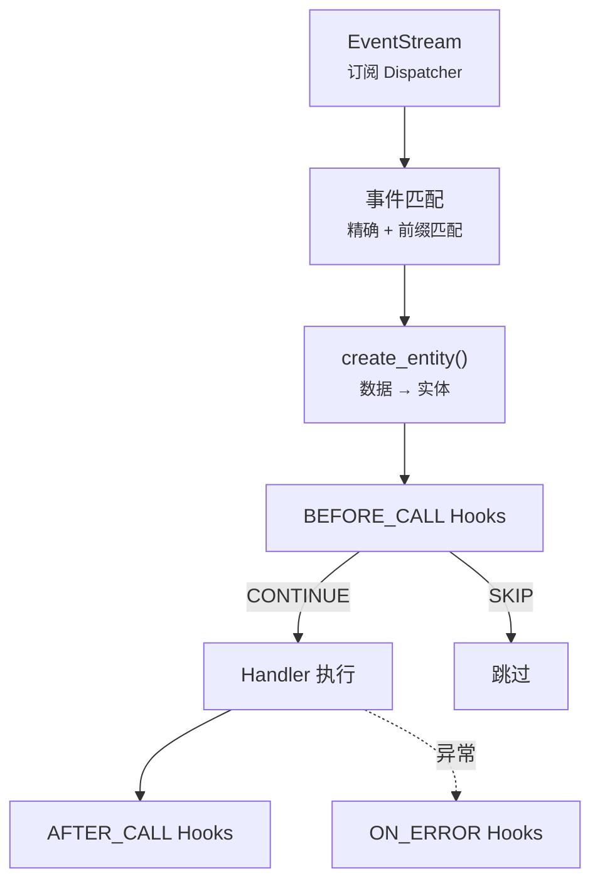
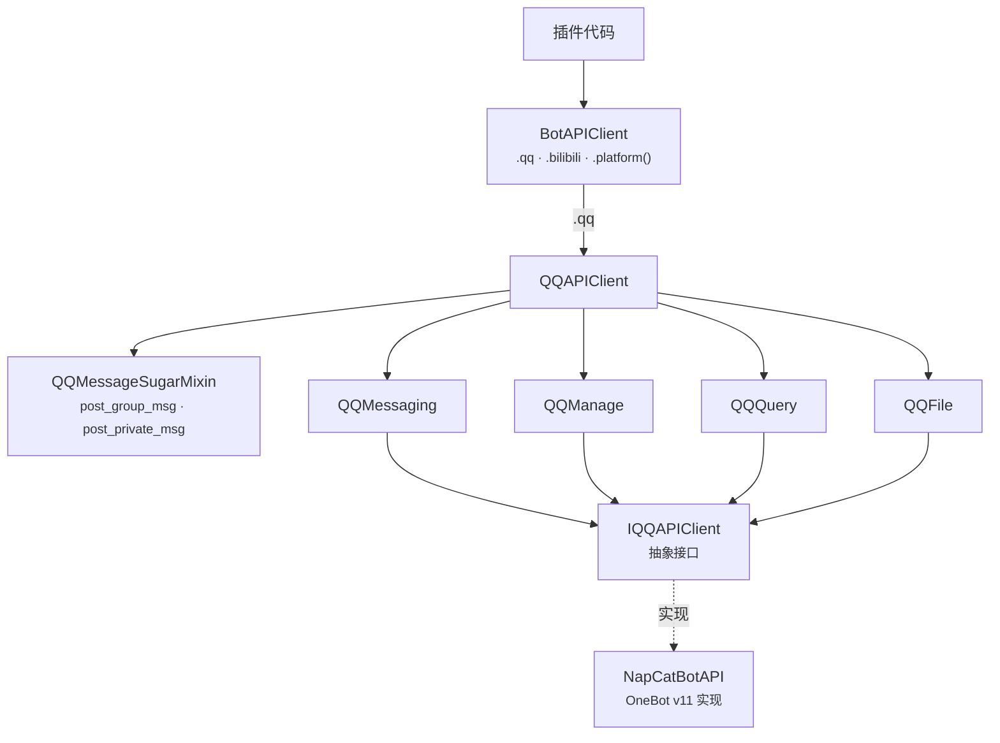

> 本文详解 NcatBot 数据流路径上的核心模块：从协议适配到事件实体，再到 API 接口层。
>
> **前置阅读**：[架构总览](<1. 架构总览.md>)

---

## 目录

- [Adapter 适配层](#adapter-适配层)
- [Types 类型模型](#types-类型模型)
- [Event 事件实体](#event-事件实体)
- [Core 核心引擎](#core-核心引擎)
- [API 接口层](#api-接口层)

---

## Adapter 适配层

适配器负责底层协议通信，将平台特定的消息格式转换为框架统一的数据模型。

### AdapterRegistry

适配器注册表是适配层的核心协调者，管理适配器的注册、发现和工厂创建：

| 方法 | 签名 | 说明 |
|---|---|---|
| `register` | `(name, cls) → None` | 注册内置适配器 |
| `discover` | `() → Dict[str, Type]` | 合并内置 + `entry_points(group="ncatbot.adapters")` 第三方适配器 |
| `list_available` | `() → list[str]` | 列出所有可用适配器类型名 |
| `create` | `(entry, *, bot_uin, websocket_timeout) → BaseAdapter` | 根据 `AdapterEntry` 创建实例，可覆盖 platform |

模块级单例 `adapter_registry` 在 `adapter/__init__.py` 中注册内置适配器。

### BaseAdapter

所有适配器的抽象基类，定义统一的生命周期接口：

| 属性/方法 | 说明 |
|---|---|
| `name: str` | 适配器名称，如 `"napcat"` |
| `platform: str` | 平台标识，如 `"qq"` / `"bilibili"` |
| `supported_protocols: List[str]` | 支持的协议列表 |
| `pip_dependencies: Dict[str, str]` | Python 包依赖声明 |
| `ensure_deps()` | 检查并安装 pip 依赖，返回是否就绪 |
| `setup()` | 准备平台环境（安装 / 配置 / 启动） |
| `connect()` | 建立连接并初始化 API |
| `disconnect()` | 断开连接，释放资源 |
| `listen()` | 阻塞监听消息，解析事件后调用回调 |
| `get_api() → IAPIClient` | 返回平台 API 实现 |
| `set_event_callback(cb)` | 设置事件数据回调（由 Dispatcher 注入） |
| `connected: bool` | 当前连接状态 |

回调签名为 `Callable[[BaseEventData], Awaitable[None]]`，即适配器只产出纯数据模型，不创建实体。

### 已注册适配器

| 注册名 | 类 | 默认 platform | 说明 |
|---|---|---|---|
| `napcat` | `NapCatAdapter` | `"qq"` | QQ / OneBot v11（WebSocket + OB11Protocol） |
| `bilibili` | `BilibiliAdapter` | `"bilibili"` | Bilibili 直播 / 私信 / 评论 |
| `github` | `GitHubAdapter` | `"github"` | GitHub Webhook（实验性） |
| `mock` | `MockAdapter` | 可配置 | 测试用，支持 `inject_event()` 注入事件 |

---

## Types 类型模型

所有事件数据的 Pydantic 模型定义，是框架最底层的协议无关数据结构。

**关键字段**：`BaseEventData.platform` 默认为 `"unknown"`，各平台子类覆盖为具体值（QQ 子类默认 `"qq"`），用于 `create_entity()` 的平台路由。

### 消息段体系

| 位置 | 内容 |
|---|---|
| `types/common/segment/` | 通用段基类（`base.py`）、文本段（`text.py`）、多媒体段（`media.py`）、`MessageArray` 容器（`array.py`） |
| `types/qq/segment/` | QQ 专用段（Face / Forward / Markdown 等） |

核心段类型：`PlainText` / `At` / `Image` / `Record` / `Video` / `File` / `Reply` / `Forward` / `MessageArray`

### 平台类型包

| 包 | 说明 |
|---|---|
| `types/qq/` | QQ 消息 / 通知 / 请求 / 元事件数据模型 + 枚举 + 发送者 |
| `types/bilibili/` | Bilibili 平台专用数据类型 |
| `types/napcat/` | NapCat API 响应类型（`SendMessageResult` / `GroupInfo` 等） |

---

## Event 事件实体

在 `BaseEventData`（纯数据）之上封装 API 操作能力，为插件提供富接口。

### 事件 Trait 体系

通过 Mixin 为事件实体附加操作能力：

| Trait | 方法 | 说明 |
|---|---|---|
| **Replyable** | `reply(**kwargs)` | 回复事件 |
| **Deletable** | `delete()` | 撤回消息 |
| **HasSender** | `user_id` / `sender` | 包含发送者信息 |
| **GroupScoped** | `group_id` | 属于某个群/频道 |
| **Kickable** | `kick(**kwargs)` | 踢出成员 |
| **Bannable** | `ban(duration=1800)` | 禁言成员 |
| **Approvable** | `approve()` / `reject()` | 审批加群/好友请求 |

### 核心组件

| 组件 | 职责 |
|---|---|
| **BaseEvent** | 包装 `BaseEventData` + `IAPIClient` 引用，`__getattr__` 代理数据字段 |
| **create_entity()** | 工厂函数：按 `data.platform` 路由到平台工厂，fallback 到 `BaseEvent` |
| **register_platform_factory()** | 注册平台专用事件工厂（如 QQ 注册 `create_qq_entity`） |

### 平台路由机制

每个平台包（`event/qq/`、`event/bilibili/`）在导入时自动调用 `register_platform_factory()` 注册自己的工厂函数。

---

## Core 核心引擎

### Dispatcher 事件分发

`AsyncEventDispatcher` — 纯异步事件广播器，无业务逻辑：

| 组件 | 职责 |
|---|---|
| **AsyncEventDispatcher** | 接收事件、类型推导（`BaseEventData.resolve_type()` 推导 `"message.group"` 等类型）、广播到所有活跃 Stream |
| **Event** | 不可变数据类，包含解析后的事件类型 + 原始数据 |
| **EventStream** | 异步迭代器，支持 `async with` / `async for` |

### Registry 处理器注册与路由

`HandlerDispatcher` — 事件到处理器的路由调度：

`HandlerDispatcher` 构造时接收 `platform_apis: Dict[str, IAPIClient]`，在 `create_entity()` 时根据 `data.platform` 选择对应的原始 API 注入事件实体。

| 组件 | 职责 |
|---|---|
| **HandlerDispatcher** | 订阅事件流、创建事件实体、匹配处理器、按优先级执行、管理 Hook 链 |
| **Registrar** | 装饰器工厂：`@registrar.on_group_command()` 等收集待注册处理器 |
| **Hook** | 中间件基类，`HookStage`（`BEFORE_CALL` / `AFTER_CALL` / `ON_ERROR`）+ `HookAction`（`CONTINUE` / `SKIP`） |
| **HookContext** | Hook 执行上下文：event / handler / services / kwargs / result / error / api |
| **CommandHook** | 命令匹配：消息预处理 → shlex 分词 → 统一前缀匹配 → binding stream 参数绑定（`At` / `int` / `float` / `str`），支持引号包裹，缺失必选参数自动回复用法 |
| **内置过滤 Hook** | `MessageTypeFilter` / `PostTypeFilter` / `SubTypeFilter` / `SelfFilter` 等 |
| **内置匹配 Hook** | `StartsWithHook` / `KeywordHook` / `RegexHook` |
| **上下文隔离** | `set_current_plugin()` / `get_current_plugin()` — ContextVar 隔离并发插件注册 |

---

## API 接口层

API 层采用多平台门面模式，`BotAPIClient` 作为统一入口路由到各平台的专用 API 客户端。

### BotAPIClient（多平台门面）

| 方法/属性 | 签名 | 说明 |
|---|---|---|
| `register_platform` | `(name, client) → None` | 注册平台 API 客户端 |
| `platform` | `(name) → Any` | 获取指定平台的 API 客户端 |
| `qq` | `→ QQAPIClient` | QQ 平台快捷属性 |
| `bilibili` | `→ Any` | Bilibili 平台快捷属性 |
| `platforms` | `→ Dict[str, Any]` | 所有已注册平台 |

### QQAPIClient

`QQAPIClient` 将 QQ 平台 API 组织为 4 个命名空间 + Sugar 便捷方法：

| 命名空间 | 说明 | 示例方法 |
|---|---|---|
| `messaging` | 消息操作 | `send_group_msg()` / `send_private_msg()` / `delete_msg()` |
| `manage` | 群管理 | `set_group_kick()` / `set_group_ban()` / `set_group_admin()` |
| `query` | 信息查询 | `get_group_list()` / `get_group_member_info()` / `get_login_info()` |
| `file` | 文件操作 | `upload_group_file()` / `download_file()` |

**Sugar 方法**（QQMessageSugarMixin）：

| 方法 | 说明 |
|---|---|
| `post_group_msg(group_id, text=, at=, reply=, image=, ...)` | 便捷群消息 — 关键字参数自动组装 MessageArray |
| `post_private_msg(user_id, text=, ...)` | 便捷私聊消息 |
| `post_group_array_msg(group_id, msg)` | 发送预构造的 MessageArray |
| `send_group_text()` / `send_group_image()` / ... | 单类型快捷发送 |

所有调用经 `QQLoggingProxy`（继承 `BaseLoggingProxy`）自动记录日志。
