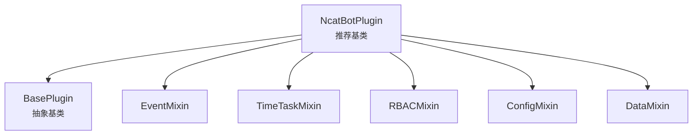
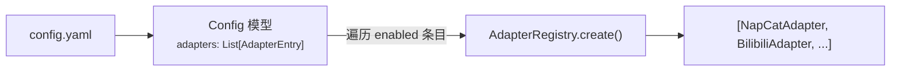
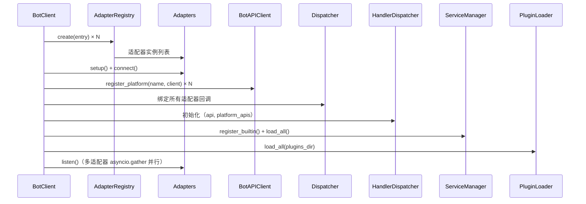
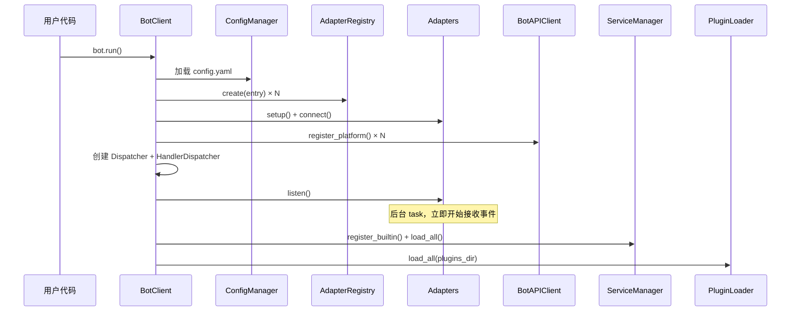
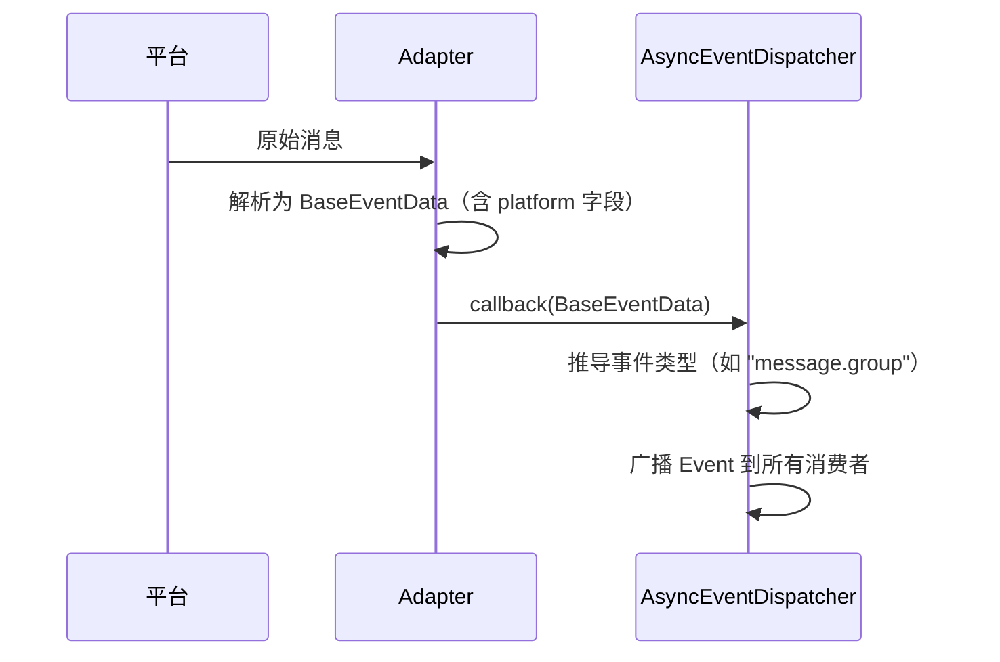
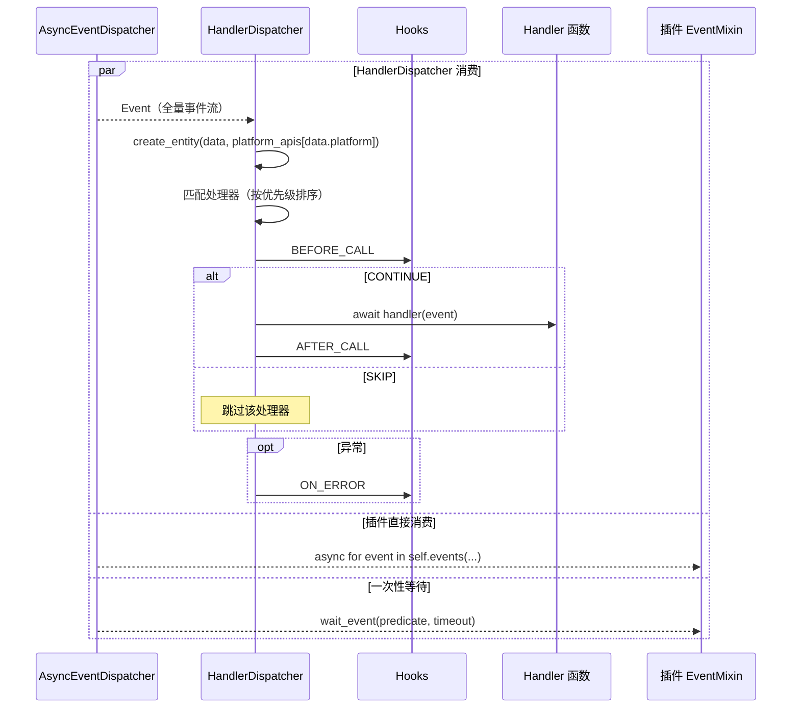
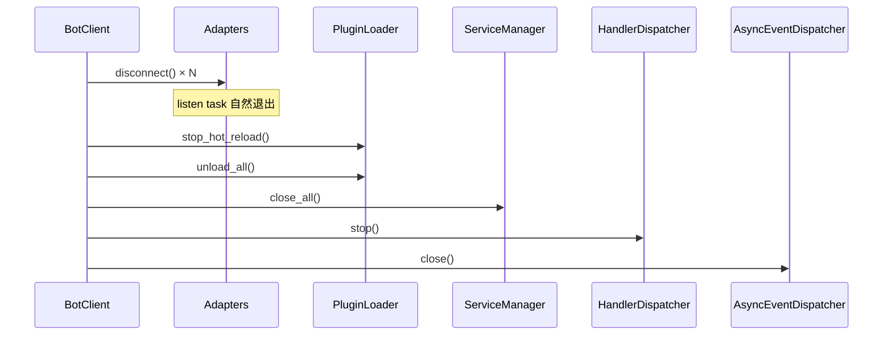
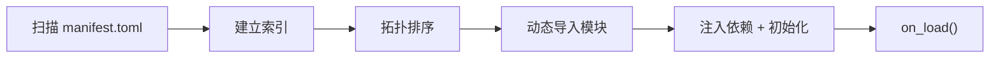

> 本文详解 NcatBot 的高层框架组件（插件、服务、工具、测试、编排、CLI）以及运行时生命周期。
>
> **前置阅读**：[架构总览](<1. 架构总览.md>) · [数据流模块](<3. 数据流模块.md>)

---

## Plugin 插件系统



**加载子系统：**

| 组件 | 职责 |
|---|---|
| **PluginLoader** | 主协调器，组合 PluginIndexer + DependencyResolver + ModuleImporter |
| **PluginIndexer** | 扫描 `manifest.toml`，建立插件索引 |
| **DependencyResolver** | 拓扑排序解析依赖顺序 |
| **ModuleImporter** | 动态导入/卸载 Python 模块，查找插件类 |
| **PipHelper** | 校验 pip 依赖、自动安装缺失包（支持 uv / pip 后端） |

---

## Service 服务层

长生命周期的后台服务，与插件系统解耦：

| 组件 | 职责 |
|---|---|
| **BaseService** | 抽象基类：`name` / `on_load()` / `on_close()` / `emit_event` |
| **ServiceManager** | 服务注册、依赖排序加载、统一关闭 |
| **RBACService** | 角色权限管理（`PermissionTrie` 高效查询、`EntityManager`、`PermissionChecker`） |
| **TimeTaskService** | 定时任务执行（`TaskExecutor` 异步执行、`TimeTaskParser` 解析 `'30s'` / `'HH:MM'`） |
| **FileWatcherService** | 文件系统监控，支持插件热重载 |

---

## Utils 工具集

| 模块 | 职责 |
|---|---|
| `logger/` | `BoundLogger` 上下文日志 + `setup_logging()` 初始化（控制台 + 滚动文件） |
| `config/` | `ConfigManager` YAML 配置管理 + `Config` / `AdapterEntry` Pydantic 模型 |
| `network.py` | `post_json()` / `get_json()` / `download_file()` + 代理支持 |
| `error.py` | `NcatBotError` / `NcatBotValueError` / `NcatBotConnectionError` 异常体系 |
| `status.py` | `Status` 全局状态追踪 |
| `prompt.py` | 交互式 CLI 工具：`confirm()` / `ask()` / `select()` + `is_interactive()` 控制模式 |

### Config 配置模型

配置系统通过 `adapters` 列表声明式定义适配器：

```yaml
# 新格式（推荐）
bot_uin: "999999"
adapters:
  - type: napcat
    platform: qq
    enabled: true
    config:
      ws_uri: ws://localhost:3001
      ws_token: napcat_ws
```

**AdapterEntry**：

| 字段 | 类型 | 说明 |
|---|---|---|
| `type` | `str` | 适配器注册表中的 key（`"napcat"` / `"bilibili"` / `"github"` / `"mock"`） |
| `platform` | `str = ""` | 平台标识，留空则使用适配器默认值 |
| `enabled` | `bool = True` | 是否启用 |
| `config` | `Dict[str, Any] = {}` | 适配器专属配置，透传给构造函数 |

**旧格式自动迁移**：`Config` 模型的 `_migrate_legacy_napcat` 验证器自动将旧版 `napcat:` 顶层配置转换为 `adapters:` 列表格式，并通过 `_migrated` PrivateAttr 标记触发配置文件自动回写。

---

## Testing 测试支持

测试模块提供离线测试全套工具，无需真实连接即可验证框架和插件行为。

| 组件 | 职责 |
|---|---|
| **TestHarness** | 框架级测试编排：BotClient + MockAdapter + 事件注入 + API 断言 |
| **PluginTestHarness** | 插件测试编排：选择性加载指定插件，提供 `get_plugin()` / `reload_plugin()` |
| **Scenario** | 链式 DSL 构建器：`inject()` → `settle()` → `assert_api_called()` → `run()` |
| **factory** | 8 个事件数据工厂：`group_message()` / `private_message()` / `friend_request()` 等 |
| **discovery** | `discover_testable_plugins()` 扫描插件 + `generate_smoke_tests()` 生成测试代码 |

### TestHarness 核心 API

| 方法 | 说明 |
|---|---|
| `inject(event_data)` | 注入单个事件 |
| `inject_many(events)` | 注入多个事件 |
| `settle(delay)` | 等待 handler 执行完 |
| `api_called(action) → bool` | 是否调用过某 API |
| `api_call_count(action) → int` | API 调用次数 |
| `get_api_calls(action) → list` | 某 API 的所有调用记录 |
| `reset_api()` | 清空调用记录 |

### PluginTestHarness

继承 `TestHarness`，增加插件管理能力：

| 参数/方法 | 说明 |
|---|---|
| `plugin_names: list[str]` | 要加载的插件名列表 |
| `plugins_dir: Path` | 插件根目录 |
| `loaded_plugins → list[str]` | 已加载插件名 |
| `get_plugin(name) → NcatBotPlugin` | 获取插件实例 |
| `plugin_config(name)` / `plugin_data(name)` | 获取插件配置/数据 |
| `reload_plugin(name)` | 热重载插件 |

---

## App 编排层

`BotClient` 是整个 Bot 的入口和生命周期管理器（Composition Root），位于 `ncatbot/app/`，组装所有核心组件。

```python
from ncatbot.app import BotClient

bot = BotClient()

@bot.on("message.group")
async def on_group_msg(event):
    await event.reply("hello")

bot.run()
```

### 多适配器支持

`BotClient` 支持三种适配器配置方式：

| 方式 | 用法 | 说明 |
|---|---|---|
| 配置驱动（推荐） | `BotClient()` | 从 `config.yaml` 的 `adapters` 列表自动创建 |
| 单适配器 | `BotClient(adapters=[adapter])` | 传入仅含一个适配器的列表 |
| 多适配器 | `BotClient(adapters=[...])` | 传入适配器列表 |

**配置驱动创建流程**：



### 启动编排

`BotClient` 启动时按以下顺序组装各组件：



### CLI 命令行工具

基于 Click 框架的命令行入口，位于 `ncatbot/cli/`：

| 子命令 | 功能 |
|---|---|
| `run` | 启动 Bot（可选 `--debug` / `--hot-reload`） |
| `dev` | 开发模式启动（默认开启 debug + 热重载） |
| `config` | 配置管理（查看 / 修改） |
| `plugin` | 插件管理（list / create / remove） |
| `napcat` | NapCat 安装与控制 |
| `init` | 初始化项目目录结构 |

---

## 生命周期

### 启动流程



### 事件处理流程

以 `AsyncEventDispatcher` 为分界，事件处理分为**上游采集**和**下游消费**两阶段。

#### 上游：事件采集与广播



#### 下游：Handler 匹配与执行



### 关闭流程



---

## 插件开发模型

### 插件结构

每个插件是一个独立目录，包含 `manifest.toml` 和入口模块：

```text
plugins/
└── my_plugin/
    ├── manifest.toml    # 插件元信息
    └── main.py          # 入口模块
```

**manifest.toml 示例：**

```toml
name = "my_plugin"
version = "1.0.0"
main = "main.py"
author = "developer"
description = "示例插件"
dependencies = []
pip_dependencies = []
```

**入口模块示例：**

```python
from ncatbot.core import registrar
from ncatbot.event.qq import GroupMessageEvent
from ncatbot.plugin import NcatBotPlugin

class MyPlugin(NcatBotPlugin):
    name = "my_plugin"
    version = "1.0.0"

    async def on_load(self):
        pass

    async def on_close(self):
        pass

    @registrar.on_group_command("hello")
    async def on_hello(self, event: GroupMessageEvent):
        # self.api 是 BotAPIClient，通过 .qq 访问 QQ 平台 API
        await self.api.qq.post_group_msg(event.group_id, text="Hello! 👋")
```

### Mixin 体系

`NcatBotPlugin` 通过 Mixin 组合提供丰富能力：

| Mixin | 能力 | 核心方法 |
|---|---|---|
| **EventMixin** | 事件消费 | `events(type)` / `wait_event(predicate, timeout)` |
| **TimeTaskMixin** | 定时任务 | `add_scheduled_task(name, interval)` / `remove_scheduled_task(name)` |
| **RBACMixin** | 权限管理 | `check_permission(user, perm)` / `add_permission()` / `remove_permission()` |
| **ConfigMixin** | 配置持久化 | `get_config(key)` / `set_config(key, value)` |
| **DataMixin** | 数据持久化 | `self.data[key]` — 字典式 JSON 存储 |

Mixin 加载顺序：EventMixin → TimeTaskMixin → RBACMixin → ConfigMixin → DataMixin。加载和卸载时 Mixin Hook 按 MRO 顺序自动执行。

### 插件加载与热重载



**热重载机制：**
- 当 **`effective_hot_reload()`** 为真时，`BotClient` 为插件目录注册 `FileWatcherService` 监视并连接 `PluginLoader.setup_hot_reload()`；否则不监视插件目录
- 检测到变更后通知 `PluginLoader`
- PluginLoader 执行：`unload_plugin()` → `rescan` → `load_plugin()`
- `HandlerDispatcher.revoke_plugin(name)` 清除旧处理器
