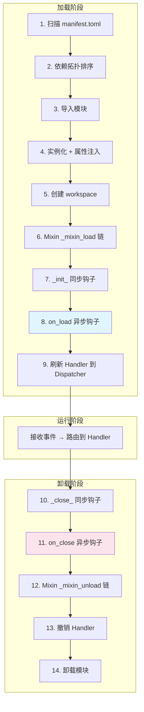

> 插件从发现到就绪的完整生命周期——扫描、依赖排序、导入、Mixin 钩子链、卸载与清理。

---

## 目录

- [全流程概览](#全流程概览)
- [加载阶段](#加载阶段)
- [Mixin 钩子链](#mixin-钩子链)
- [卸载阶段](#卸载阶段)
- [开发者钩子 API](#开发者钩子-api)
- [常见模式](#常见模式)

---

## 全流程概览



---

## 加载阶段

### 1. 扫描

`PluginIndexer` 递归扫描 `plugins/` 目录，查找所有包含 `manifest.toml` 的子目录：

```text
plugins/
├── hello_world/manifest.toml  ✅ 发现
├── my_plugin/manifest.toml    ✅ 发现
└── no_manifest/               ❌ 跳过
```

解析 `manifest.toml` 为 `PluginManifest` 对象，验证必填字段和入口文件是否存在。

### 2. 依赖拓扑排序

`DependencyResolver` 使用 **Kahn 算法**（拓扑排序）确定加载顺序：

- 根据 `manifest.toml` 中的 `[dependencies]` 构建有向依赖图
- 无依赖的插件先加载，被依赖的插件保证在依赖方之前加载
- **检测循环依赖**：如果存在 A → B → A 的环，会抛出 `PluginCircularDependencyError`
- **检测缺失依赖**：如果依赖的插件不存在，会抛出 `PluginMissingDependencyError`
- 使用 `packaging.specifiers` 验证版本约束

### 3. 导入模块

`ModuleImporter` 使用 `importlib` 动态导入插件入口模块：

- 插件根目录被添加到 `sys.path`（低优先级，不影响标准库和第三方包）
- 导入前自动清理 `__pycache__`，确保代码更新生效
- 使用 `ContextVar` 隔离当前加载插件的名称（用于装饰器注册 Handler 时标记归属）
- 如果 `__init__.py` 中含 `from .main import ...`，Python import system 会先于 `load_module()` 导入入口模块。框架会检测到入口模块已在 `sys.modules` 中，**直接复用而不重新执行**，避免装饰器注册出重复的 Handler

### 4. 实例化 + 属性注入

`PluginLoader._instantiate()` 创建插件实例并注入运行时属性：

```python
plugin.workspace = plugin_workspace_path
plugin.services = service_manager
plugin.api = bot_api_client
plugin._dispatcher = event_dispatcher
plugin._plugin_loader = self
plugin._manifest = manifest
plugin._debug = debug_flag
```

### 5-8. `__onload__()` 编排

框架调用 `plugin.__onload__()`，该方法按顺序执行：

```python
async def __onload__(self) -> None:
    self.workspace.mkdir(exist_ok=True, parents=True)  # 5. 创建工作目录
    await self._run_mixin_hooks("_mixin_load")          # 6. Mixin 加载钩子
    self._init_()                                        # 7. 同步预初始化
    await self.on_load()                                 # 8. 异步主初始化
```

### 9. 刷新 Handler

`on_load()` 中通过 `@registrar.on_*()` 装饰器注册的 Handler 会被暂存，`__onload__()` 完成后一次性刷新到 `HandlerDispatcher`。

---

## Mixin 钩子链

`NcatBotPlugin` 继承链中的每个 Mixin 都可以定义 `_mixin_load()` 和 `_mixin_unload()` 钩子。框架按 **MRO（方法解析顺序）** 自动发现并依次执行。

### 执行顺序

```text
NcatBotPlugin(BasePlugin, EventMixin, TimeTaskMixin, RBACMixin, ConfigMixin, DataMixin)
```

| 顺序 | Mixin | `_mixin_load()` 做什么 | `_mixin_unload()` 做什么 |
|------|-------|----------------------|------------------------|
| 1 | `EventMixin` | 初始化事件流列表 | 关闭所有活跃的 `EventStream` |
| 2 | `TimeTaskMixin` | 初始化任务名列表 | 清理所有定时任务 |
| 3 | `RBACMixin` | （无特殊操作） | （无特殊操作） |
| 4 | `ConfigMixin` | 从 `config.yaml` 加载配置 | 保存配置到 `config.yaml` |
| 5 | `DataMixin` | 从 `data.json` 加载数据 | 保存数据到 `data.json` |

### 独立容错

每个 Mixin 钩子在独立的 `try/except` 中执行——**单个 Mixin 失败不会阻止其他 Mixin 初始化**：

```python
async def _run_mixin_hooks(self, hook_name: str):
    for cls in type(self).__mro__:
        hook = cls.__dict__.get(hook_name)
        if hook is not None:
            try:
                result = hook(self)
                if asyncio.iscoroutine(result):
                    await result
            except Exception:
                LOG.exception("Mixin hook %s.%s 执行失败", cls.__name__, hook_name)
```

---

## 卸载阶段

### `__unload__()` 编排

```python
async def __unload__(self) -> None:
    self._close_()                                       # 10. 同步后清理
    await self.on_close()                                # 11. 异步清理
    await self._run_mixin_hooks("_mixin_unload")          # 12. Mixin 卸载钩子
```

### Handler 撤销

卸载后，`HandlerDispatcher.revoke_plugin(name)` 移除该插件注册的所有 Handler，确保不会再响应事件。

### 模块清理

`ModuleImporter.unload_module()` 从 `sys.modules` 中移除插件相关的模块条目，释放旧代码引用。

---

## 开发者钩子 API

作为插件开发者，你可以重写以下 4 个生命周期钩子：

| 钩子 | 类型 | 调用时机 | 典型用途 |
|------|------|---------|---------|
| `_init_(self)` | 同步 | Mixin 加载后、`on_load()` 之前 | 同步初始化（较少使用） |
| `on_load(self)` | 异步 | 主初始化 | **注册事件处理器、初始化数据、启动后台任务** |
| `on_close(self)` | 异步 | 卸载时 | 清理资源、保存状态 |
| `_close_(self)` | 同步 | `on_close()` 之前 | 同步清理（较少使用） |

**最常用的是 `on_load()` 和 `on_close()`**：

```python
class MyPlugin(NcatBotPlugin):
    name = "my_plugin"
    version = "1.0.0"

    async def on_load(self):
        if not self.get_config("prefix"):
            self.set_config("prefix", "/")
        self.data.setdefault("counter", 0)
        self.add_scheduled_task("heartbeat", "60s")
        LOG.info("MyPlugin 已加载")

    async def on_close(self):
        LOG.info("MyPlugin 已卸载，累计计数: %d", self.data.get("counter", 0))
```

> 完整示例：[examples/common/02_config_and_data/](../../../examples/common/02_config_and_data/README.md) 展示了在 `on_load()` 中初始化配置和数据。

---

## 常见模式

### 在 on_load() 中注册事件处理器

所有 `@registrar.on_*()` 装饰的方法会在类定义时收集，在 `on_load()` 完成后自动刷新到分发器。通常不需要在 `on_load()` 中手动操作 Handler。

### 在 on_load() 中启动后台任务

如果需要持续运行的后台任务，在 `on_load()` 中使用 `asyncio.create_task()`，并在 `on_close()` 中取消：

```python
class MyPlugin(NcatBotPlugin):
    name = "my_plugin"
    version = "1.0.0"

    async def on_load(self):
        self._task = asyncio.create_task(self._background_worker())

    async def on_close(self):
        if hasattr(self, "_task"):
            self._task.cancel()

    async def _background_worker(self):
        try:
            async with self.events("message") as stream:
                async for event in stream:
                    LOG.info("收到消息: %s", event.data.raw_message)
        except asyncio.CancelledError:
            pass
```

> 完整示例：[examples/qq/01_event_registration/](../../../examples/qq/01_event_registration/README.md) 的 `_stream_listener()` 方法。

---

## 下一步

- [事件注册与装饰器](<4. 事件注册.md>) — 深入三种事件消费模式
- [配置与数据 Mixin](<7. 配置与数据.md>) — 了解各 Mixin 钩子在生命周期中的作用
- [高级模式](<10. 模式.md>) — 热重载如何利用完整的加载/卸载周期
