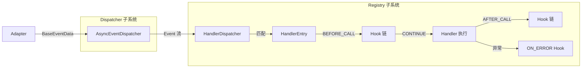
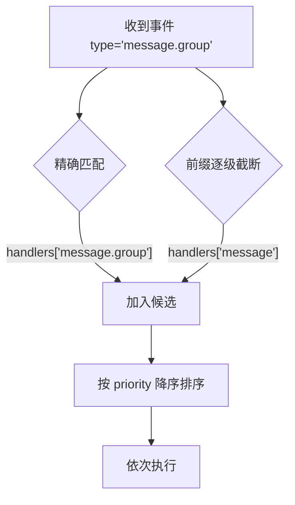
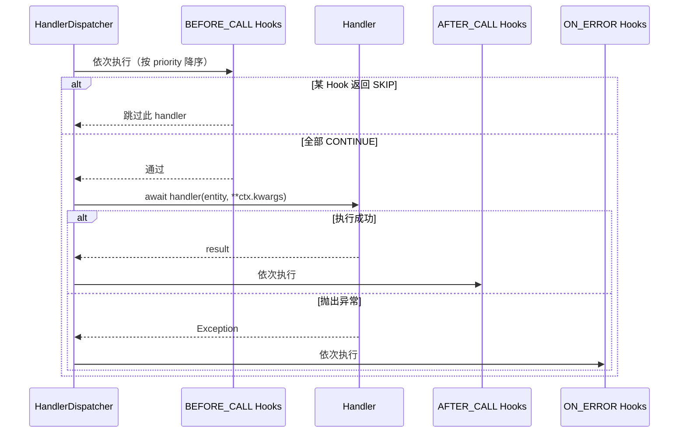

> Registry 注册/发现流程、Dispatcher 分发策略、生命周期钩子、错误处理与扩展点。

---

## 目录

- [1. 架构总览](#1-架构总览)
- [2. 事件类型解析机制](#2-事件类型解析机制)
- [3. 事件匹配算法](#3-事件匹配算法)
- [4. 分发执行流程](#4-分发执行流程)
- [5. Hook 链机制](#5-hook-链机制)
- [6. 插件热重载](#6-插件热重载)
- [7. 错误处理](#7-错误处理)
- [8. 扩展点](#8-扩展点)

---

## 1. 架构总览

核心引擎分为 **Dispatcher（事件分发）** 和 **Registry（处理器注册与路由）** 两个子系统：



**数据流**: Adapter 推送 `BaseEventData` → `AsyncEventDispatcher` 解析类型并广播 `Event` → `HandlerDispatcher` 消费事件流，匹配 handler → 执行 Hook 链 → 调用 handler。

---

## 2. 事件类型解析机制

`BaseEventData.resolve_type()` 从数据模型推导事件类型字符串。各平台通过 `register_platform_secondary_keys()` 注册自己的 secondary key 映射，子类可 override 此方法提供自定义逻辑。

### 解析规则

格式：`"{post_type}.{secondary_type}"`

默认实现通过平台注册的 secondary key 查注册表，找到属性名后提取值并拼接。

### 解析流程

```text
BaseEventData.resolve_type()
  ├─ 读取 self.post_type → "message"
  ├─ get_secondary_key(platform, post_type) → "message_type"
  ├─ 读取 self.message_type → "group"
  └─ 拼接 → "message.group"
```

所有 Notice 事件统一走默认 `resolve_type()`：`notice.{notice_type}`（如 `notice.notify`、`notice.group_ban`）。
Notify 子类型（poke/lucky_king/honor）通过 `SubTypeFilter` hook 在 handler 层过滤。

### EventStream 类型过滤

`EventStream` 使用 **前缀匹配** 过滤事件：

| 传入值 | 匹配行为 |
|---|---|
| `EventType.MESSAGE`（= `"message"`） | 匹配 `"message"` 及所有 `"message.*"` |
| `"message.group"` | 仅精确匹配 `"message.group"` |
| `None` | 不过滤，接收全部事件 |

---

## 3. 事件匹配算法

`HandlerDispatcher._collect_handlers()` 使用 **精确 + 前缀** 两级匹配：



### 匹配规则

1. **精确匹配**: 事件类型 `"message.group"` 匹配注册了 `"message.group"` 的 handler
2. **前缀匹配**: 逐级截断 `.` 分隔符 — `"message.group"` 也匹配 `"message"` 上的 handler
3. **优先级排序**: 所有匹配结果按 `priority` **降序排序**，数值越大越先执行

### 匹配示例

假设注册了以下 handler：

| handler | 注册类型 | priority |
|---|---|---|
| `h1` | `"message.group"` | 100 |
| `h2` | `"message"` | 50 |
| `h3` | `"notice.group_increase"` | 100 |

收到 `type="message.group"` 时：`h1`（精确）和 `h2`（前缀）被匹配，按 priority 排序后执行顺序为 `h1` → `h2`。

---

## 4. 分发执行流程

对每个匹配的 handler，`HandlerDispatcher` 执行以下完整流程：



### 关键行为

- **传播中断**: 当 `event.data._propagation_stopped` 为 `True` 时，后续 handler 不再执行
- **异步要求**: Handler 必须是 **async 函数**，同步函数会在注册时被跳过
- **插件实例注入**: 插件实例方法通过 `metadata["plugin_instance"]` 注入 `self` 参数

---

## 5. Hook 链机制

Hook 在 handler 执行前后拦截，用于过滤、日志、权限检查等横切关注点。

### HookStage — 执行阶段

| 阶段 | 时机 | 典型用途 |
|---|---|---|
| `BEFORE_CALL` | handler 执行前 | 消息类型过滤、权限检查、日志前置 |
| `AFTER_CALL` | handler 成功执行后 | 结果后处理、统计 |
| `ON_ERROR` | handler 抛出异常时 | 异常日志、降级处理 |

### HookAction — 返回动作

| 动作 | 效果 |
|---|---|
| `CONTINUE` | 继续执行下一个 Hook 或 handler |
| `SKIP` | 跳过当前 handler（仅 `BEFORE_CALL` 阶段有效） |

### 执行顺序

同一阶段的多个 Hook 按 `priority` **降序**执行。任一 `BEFORE_CALL` Hook 返回 `SKIP` 即终止该 handler 的执行。

### Hook 抽象基类

```python
class Hook(ABC):
    stage: HookStage
    priority: int = 0

    def __call__(self, func: Callable) -> Callable:
        """装饰器模式: 将自身绑定到 func.__hooks__"""
        ...

    @abstractmethod
    async def execute(self, ctx: HookContext) -> HookAction:
        """Hook 执行逻辑 (异步)，子类必须实现"""
        ...
```

Hook 实例有**两种角色**：
- **装饰器**：`@hook_instance` — 同步 `__call__(func)` 将自身绑定到 `func.__hooks__`
- **执行器**：`await hook.execute(ctx)` — 异步执行 Hook 逻辑

### HookContext — 上下文

```python
@dataclass
class HookContext:
    event: Event                           # 当前事件
    event_type: str                        # 事件类型字符串
    handler_entry: HandlerEntry            # 当前 handler 条目
    api: BotAPIClient                      # API 实例
    services: Optional[ServiceManager] = None  # 服务管理器
    kwargs: Dict[str, Any] = field(default_factory=dict)  # 共享参数字典
    result: Any = None                     # handler 返回值（AFTER_CALL 阶段）
    error: Optional[Exception] = None      # 异常对象（ON_ERROR 阶段）
```

### 内置 Hook 一览

| Hook | 阶段 | 说明 |
|---|---|---|
| `MessageTypeFilter` | `BEFORE_CALL` | 按 `message_type`（group/private）过滤 |
| `PostTypeFilter` | `BEFORE_CALL` | 按 `post_type` 过滤 |
| `SubTypeFilter` | `BEFORE_CALL` | 按 `sub_type` 过滤 |
| `SelfFilter` | `BEFORE_CALL` | 过滤 Bot 自身发出的消息 |
| 文本匹配 Hook | `BEFORE_CALL` | 按关键词、正则、前缀等匹配消息文本 |

---

## 6. 插件热重载

`HandlerDispatcher.revoke_plugin()` 支持运行时移除指定插件的所有 handler：

```python
removed_count = handler_dispatcher.revoke_plugin("my_plugin")
# 重新加载插件后，新 handler 自动注册
```

**流程**: 卸载旧插件（`revoke_plugin` 清理 handler）→ 重新导入插件模块 → 新 handler 通过 `Registrar` 重新注册。

---

## 7. 错误处理

### handler 执行异常

当 handler 抛出异常时，`HandlerDispatcher` 不会崩溃：

1. 捕获异常，将其置入 `HookContext.error`
2. 执行 `ON_ERROR` 阶段的 Hook 链
3. 记录错误日志
4. 继续处理后续 handler（除非传播已被中断）

### Dispatcher 关闭异常

- `close()` 调用后，所有活跃 `EventStream` 收到 `_STOP` 哨兵并正常退出迭代
- 所有 pending 的 `wait_event()` 收到 `RuntimeError`
- 重复调用 `close()` 安全（幂等）

---

## 8. 扩展点

### 自定义 Hook

继承 `Hook` 基类，实现 `execute` 方法：

```python
from ncatbot.core.registry.hook import Hook, HookStage, HookAction, HookContext

class RateLimitHook(Hook):
    stage = HookStage.BEFORE_CALL
    priority = 200  # 高优先级，先于其他 Hook 执行

    async def execute(self, ctx: HookContext) -> HookAction:
        user_id = getattr(ctx.event.data, "user_id", None)
        if user_id and self.is_rate_limited(user_id):
            return HookAction.SKIP
        return HookAction.CONTINUE
```

### 自定义事件消费

无需 `HandlerDispatcher`，可直接消费 `AsyncEventDispatcher` 的事件流：

```python
async with event_dispatcher.events(EventType.NOTICE) as stream:
    async for event in stream:
        # 自定义处理逻辑
        await custom_notice_handler(event)
```

### Registrar — 装饰器注册

`Registrar` 提供装饰器式 handler 注册，使用 `ContextVar` 实现插件隔离：

- `on(event_type, priority, platform)` — 通用事件注册装饰器
- 便捷装饰器 — 各事件类型的快捷注册
- 命令装饰器 — 命令匹配注册
- `flush_pending()` — 将当前 ContextVar 中暂存的 handler 刷入 `HandlerDispatcher`

**模块**: `ncatbot.core.registry.registrar`
