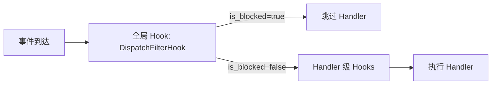

> 源码：`ncatbot/service/builtin/dispatch_filter/service.py`
> 服务名称：`"dispatch_filter"`
> 数据文件：`data/dispatch_filter.json`

按群/用户维度禁用指定插件或命令。规则持久化到 JSON 文件，通过 HandlerDispatcher 的全局 Hook 在事件分发前生效。

---

## 初始化参数

```python
class DispatchFilterService(BaseService):
    name = "dispatch_filter"

    def __init__(
        self,
        storage_path: Optional[str] = "data/dispatch_filter.json",
        **config,
    ):
```

| 参数 | 类型 | 默认值 | 说明 |
|---|---|---|---|
| `storage_path` | `str \| None` | `"data/dispatch_filter.json"` | 持久化文件路径，`None` 则不持久化 |

---

## FilterRule 数据模型

```python
from ncatbot.service.builtin.dispatch_filter.model import FilterRule
```

| 字段 | 类型 | 默认值 | 说明 |
|------|------|--------|------|
| `scope_type` | `Literal["group", "user"]` | — | 作用域类型 |
| `scope_id` | `str` | — | 群号或用户号 |
| `plugin_name` | `str` | — | 目标插件名（`"*"` = 全部插件） |
| `commands` | `List[str]` | `[]` | 目标命令列表（空列表 = 整个插件） |
| `action` | `Literal["deny"]` | `"deny"` | 动作（预留扩展） |
| `rule_id` | `str` | 自动生成 | 规则唯一标识（12 位十六进制） |

### matches()

```python
def matches(
    self,
    plugin_name: str,
    command: Optional[str],
    group_id: Optional[str],
    user_id: Optional[str],
) -> bool
```

判断规则是否拦截给定上下文。匹配逻辑：

1. **作用域匹配**：`scope_type` 为 `"group"` 时检查 `group_id`，为 `"user"` 时检查 `user_id`
2. **插件匹配**：`plugin_name == "*"` 匹配全部，否则精确匹配
3. **命令匹配**：`commands` 为空匹配全部，否则 `command` 须在列表内

---

## 核心查询

### is_blocked()

```python
def is_blocked(
    self,
    plugin_name: str,
    command: Optional[str],
    group_id: Optional[str],
    user_id: Optional[str],
) -> bool
```

查询给定上下文是否被任一规则拦截。同时检查 group 和 user 两个维度。

---

## 规则管理

| 方法 | 签名 | 说明 |
|------|------|------|
| `add_rule` | `(rule: FilterRule) -> FilterRule` | 添加规则并自动持久化 |
| `remove_rule` | `(rule_id: str) -> bool` | 按 `rule_id` 移除规则 |
| `list_rules` | `(scope_type=None, scope_id=None, plugin_name=None) -> List[FilterRule]` | 条件查询规则 |
| `clear_rules` | `(plugin_name=None) -> int` | 批量清除规则，返回清除数量 |
| `save` | `(path=None) -> None` | 手动保存到文件 |

---

## 生命周期

| 阶段 | 行为 |
|------|------|
| `on_load` | 从 `storage_path` 加载已有规则 |
| `on_close` | 保存规则到文件 |

---

## 全局 Hook 集成

`DispatchFilterHook` 作为 `HandlerDispatcher` 的全局 `BEFORE_CALL` Hook（priority=200），在每个 handler 执行前自动查询 `DispatchFilterService.is_blocked()`。



从 `HookContext` 提取的信息：

| 数据 | 来源 |
|------|------|
| `plugin_name` | `handler_entry.plugin_name` |
| `group_id` | `event.data.group_id` |
| `user_id` | `event.data.user_id` 或 `event.data.sender_id` |
| `command` | handler 上绑定的 `CommandHook` 的命令名 |

---

## 相关文档

- [DispatchFilterMixin](<../5. 插件系统/2. Mixins.md>) — 插件中的便捷 API
- [内置管理命令](<../5. 插件系统/3. 内置管理命令.md>) — `!filter` 命令
- [注册表参考](<../4. 核心模块/3. 注册表.md>) — HandlerDispatcher 全局 Hook
- [示例插件](../../../examples/common/08_dispatch_filter/README.md) — 分发过滤完整示例
