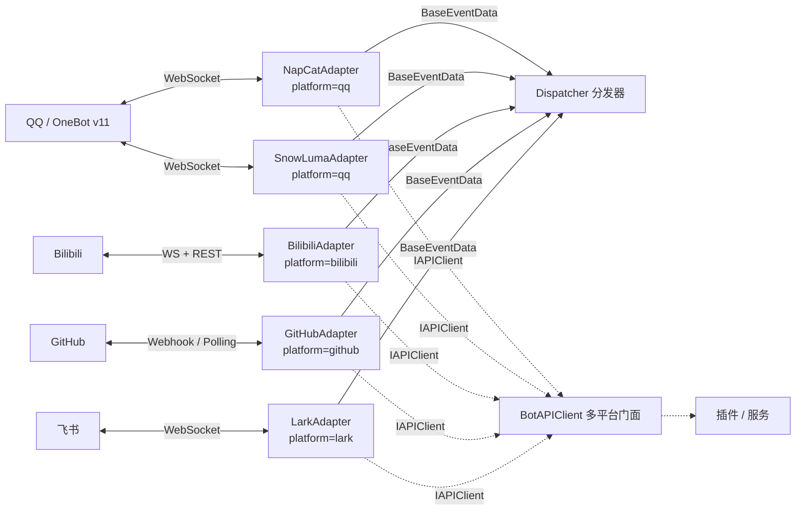

> 适配器层完整参考 — 多平台适配、WebSocket 连接、事件解析、API 调用

---

## Quick Reference

```python
from ncatbot.adapter import BaseAdapter, NapCatAdapter, SnowLumaAdapter, MockAdapter
from ncatbot.adapter.bilibili import BilibiliAdapter
from ncatbot.adapter.github import GitHubAdapter
from ncatbot.adapter.lark import LarkAdapter
```

适配层（Adapter）负责屏蔽底层通信协议差异，为上层提供统一的事件流和 Bot API 接口。

| 适配器 | `platform` | 协议 | 用途 | 使用指南 |
|---|---|---|---|---|
| `NapCatAdapter` | `"qq"` | OneBot v11 (WebSocket) | QQ 群聊/私聊 Bot | [NapCat 指南](<../../guide/2. 适配器/1. NapCat QQ.md>) |
| `SnowLumaAdapter` | `"qq"` | OneBot v11 (WebSocket) | 独立 OneBot v11 协议端 / QQ Bot | [SnowLuma 指南](<../../guide/2. 适配器/7. SnowLuma QQ.md>) |
| `BilibiliAdapter` | `"bilibili"` | bilibili-api-python | 直播弹幕 / 私信 / 评论 | [Bilibili 指南](<../../guide/2. 适配器/2. Bilibili.md>) |
| `GitHubAdapter` | `"github"` | Webhook / REST Polling | Issue/PR/Push 事件处理 | [GitHub 指南](<../../guide/2. 适配器/3. GitHub.md>) |
| `LarkAdapter` | `"lark"` | lark-oapi SDK (WebSocket) | 飞书群聊/私聊 Bot | [Lark 指南](<../../guide/2. 适配器/6. Lark.md>) |
| `MockAdapter` | `"mock"` | 内存模拟 | 测试环境，无需网络 | [Mock 指南](<../../guide/2. 适配器/4. Mock 适配器.md>) |



> `NapCatAdapter` 与 `SnowLumaAdapter` 的 `platform` 都是 `qq`，同一个 `BotClient` 内不能同时启用。SnowLuma 的协议层实现复用 NapCat 的连接与协议模块，差异主要体现在 `setup/` 流程。

### BaseAdapter 抽象接口

| 属性/方法 | 签名 | 说明 |
|-----------|------|------|
| `name` | `str` | 适配器名称 |
| `platform` | `str` | 平台标识（`"qq"` / `"mock"` 等） |
| `supported_protocols` | `List[str]` | 支持的协议列表 |
| `setup` | `async () → None` | *abstract* — 准备平台环境 |
| `ensure_deps` | `async () → bool` | 检查并安装 pip 依赖，返回是否就绪 |
| `connect` | `async () → None` | *abstract* — 建立连接并初始化 API |
| `disconnect` | `async () → None` | *abstract* — 断开连接，释放资源 |
| `listen` | `async () → None` | *abstract* — 阻塞监听消息 |
| `get_api` | `() → IAPIClient` | *abstract* — 返回 API 客户端 |
| `connected` | `@property → bool` | *abstract* — 连接状态 |
| `set_event_callback` | `(callback) → None` | 设置事件数据回调 |
| `cli_configure` | `@classmethod () → Dict[str, Any]` | CLI 交互式配置钩子（`ncatbot init` / `ncatbot adapter` 调用） |

### cli_configure — CLI 配置钩子

`BaseAdapter.cli_configure()` 是各适配器为 CLI 命令（`ncatbot init`、`ncatbot adapter`）提供的交互式配置入口。子类覆盖此方法以实现平台特有的配置流程，返回可序列化到 `config.yaml` 中 `adapters[].config` 的字典。

| 适配器 | 交互流程 | 智能跳过逻辑 |
|--------|---------|-------------|
| NapCat | 询问是否自动安装 → WS/WebUI 配置 | 选择自动安装时跳过 WS/WebUI 输入，使用默认值（启动时 `configure_all()` 自动配置） |
| SnowLuma | 询问是否自动安装 → WS/WebUI 配置 | 选择自动安装时跳过 WS/WebUI 输入，返回默认值；首次启动仍需在 WebUI 手动启用 OneBot v11 |
| Bilibili | 询问是否扫码登录 → 凭据/数据源配置 | 选择扫码时跳过 sessdata 等凭据手动输入（扫码自动获取） |
| GitHub | Token → 仓库 → 模式（Webhook/Polling） | — |
| Lark | App ID → App Secret | — |

### AdapterRegistry 方法

| 方法 | 签名 | 说明 |
|------|------|------|
| `register` | `(name, cls) → None` | 注册适配器类 |
| `discover` | `() → Dict[str, Type[BaseAdapter]]` | 发现内置 + entry_point 适配器 |
| `list_available` | `() → list[str]` | 列出可用适配器名 |
| `create` | `(entry, *, bot_uin="", websocket_timeout=15) → BaseAdapter` | 工厂创建适配器实例 |

### MockAdapter 方法（测试用）

| 方法 | 签名 | 说明 |
|------|------|------|
| `inject_event` | `async (data: BaseEventData) → None` | 注入测试事件 |
| `stop` | `() → None` | 停止 listen 循环 |
| `mock_api` | `@property → MockAPIBase` | 获取 Mock API 实例 |

### MockAPIBase 体系（所有 Mock API 共享基类）

MockAdapter 根据 `platform` 参数自动选择对应的 Mock API 子类：

| 平台 | Mock 类 | 实现接口 |
|------|---------|---------|
| `qq` | `MockBotAPI` | `IQQAPIClient` |
| `bilibili` | `MockBiliAPI` | `IBiliAPIClient` |
| `github` | `MockGitHubAPI` | `IGitHubAPIClient` |

### MockAPIBase 调用记录方法

| 方法 | 签名 | 说明 |
|------|------|------|
| `called` | `(action) → bool` | 检查 action 是否被调用 |
| `call_count` | `(action) → int` | 调用次数 |
| `get_calls` | `(action) → List[APICall]` | 获取指定调用记录 |
| `last_call` | `(action=None) → Optional[APICall]` | 最后一次调用 |
| `set_response` | `(action, response) → None` | 预设返回值 |
| `reset` | `() → None` | 清除所有记录 |

> `APICall.params: Dict[str, Any]` — 所有参数以命名形式存储。

**源码位置**: `ncatbot/adapter/` · 详见 [适配器使用指南](<../../guide/2. 适配器/README.md>) · [多平台开发指南](<../../guide/10. 多平台开发/README.md>)

---

## BilibiliAdapter

**模块**: `ncatbot.adapter.bilibili`

| 属性 | 值 |
|------|-----|
| `name` | `"bilibili"` |
| `platform` | `"bilibili"` |
| `supported_protocols` | `["bilibili_live", "bilibili_session", "bilibili_comment"]` |
| `pip_dependencies` | `{"bilibili-api-python": ">=17.0.0"}` |

### BilibiliConfig 配置模型

| 字段 | 类型 | 默认值 | 说明 |
|------|------|--------|------|
| `sessdata` | `str` | `""` | SESSDATA Cookie |
| `bili_jct` | `str` | `""` | CSRF Token |
| `buvid3` | `str` | `""` | 设备指纹 |
| `dedeuserid` | `str` | `""` | 用户 UID |
| `ac_time_value` | `str` | `""` | 账号时间戳 |
| `live_rooms` | `List[int]` | `[]` | 直播间房间号 |
| `enable_session` | `bool` | `false` | 启用私信 |
| `comment_watches` | `List[CommentWatch]` | `[]` | 评论监听 |
| `session_poll_interval` | `float` | `6.0` | 私信轮询间隔 |
| `comment_poll_interval` | `float` | `30.0` | 评论轮询间隔 |
| `max_retry` | `int` | `5` | 最大重连次数 |
| `retry_after` | `float` | `1.0` | 重连延迟 |

### 认证流程

1. `setup()` 检查 `sessdata` 是否非空
2. 非空 → 构造 `Credential` 并调用 `check_valid()` 验证
3. 验证失败或为空 → 调用 `qrcode_login()` 扫码登录
4. 登录成功 → `save_credential_to_config()` 写回 config.yaml

详见 [Bilibili 使用指南](<../../guide/2. 适配器/2. Bilibili.md>)。

---

## GitHubAdapter

**模块**: `ncatbot.adapter.github`

| 属性 | 值 |
|------|-----|
| `name` | `"github"` |
| `platform` | `"github"` |
| `supported_protocols` | `["github_webhook", "github_polling"]` |

### GitHubConfig 配置模型

| 字段 | 类型 | 默认值 | 说明 |
|------|------|--------|------|
| `token` | `str` | `""` | GitHub PAT |
| `repos` | `List[str]` | `[]` | 监听仓库 (`owner/repo`) |
| `mode` | `Literal["webhook", "polling"]` | `"webhook"` | 连接模式 |
| `webhook_host` | `str` | `"0.0.0.0"` | HTTP Server 地址 |
| `webhook_port` | `int` | `8080` | HTTP Server 端口 |
| `webhook_path` | `str` | `"/webhook"` | Webhook 路径 |
| `webhook_secret` | `str` | `""` | 签名 Secret |
| `poll_interval` | `float` | `60.0` | Polling 间隔 |

### 认证流程

1. `setup()` 调用 `GET /user` 验证 Token
2. 验证成功打印用户名，失败抛出异常
3. 不配置 Token 也可运行（公开仓库 Webhook），但 API 速率受限

详见 [GitHub 使用指南](<../../guide/2. 适配器/3. GitHub.md>)。

---

## LarkAdapter

**模块**: `ncatbot.adapter.lark`

| 属性 | 值 |
|------|-----|
| `name` | `"lark"` |
| `platform` | `"lark"` |
| `supported_protocols` | `["lark_ws"]` |
| `pip_dependencies` | `{"lark-oapi": ">=1.5.3"}` |

### LarkConfig 配置模型

| 字段 | 类型 | 默认值 | 说明 |
|------|------|--------|------|
| `app_id` | `str` | `""` | 飞书应用 App ID |
| `app_secret` | `str` | `""` | 飞书应用 App Secret |
| `verification_token` | `str` | `""` | 事件验证 Token |
| `encrypt_key` | `str` | `""` | 事件加密 Key |

### 连接流程

1. `setup()` 验证 `app_id` 和 `app_secret` 非空
2. `connect()` 创建 lark-oapi Client 和 WebSocket 客户端
3. `listen()` 在独立线程中启动 SDK WebSocket 监听
4. 事件回调通过 `run_coroutine_threadsafe` 调度到主事件循环

详见 [Lark 使用指南](<../../guide/2. 适配器/6. Lark.md>)。

---

## 适配器组件速查

---

## 本目录索引

| 文件 | 说明 |
|------|------|
| [1. 连接](<1. 连接.md>) | WebSocket 连接管理 — NapCatWebSocket、重连策略、NapCat / SnowLuma 启动编排 |
| [2. 协议](<2. 协议.md>) | 协议处理 — OB11Protocol 请求-响应匹配、事件解析、NapCatBotAPI 实现（SnowLuma 共用） |
